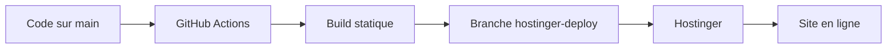
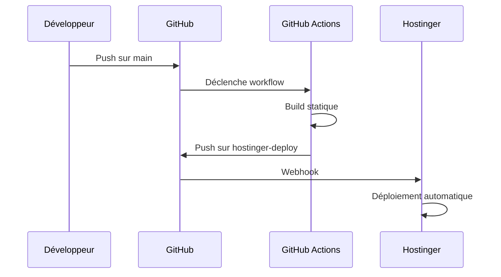

# 🚀 Guide Complet GitHub & Intégration Hébergement

For Hostinger configuration specifics see [HOSTINGER_GIT_SETUP.md](./HOSTINGER_GIT_SETUP.md).

## 📚 Table des matières

1. [Introduction à GitHub](#1-introduction-à-github)
2. [Création d'un dépôt GitHub](#2-création-dun-dépôt-github)
3. [Utilisation des branches](#3-utilisation-des-branches)
4. [Commits](#4-commits)
5. [Pull Requests](#5-pull-requests)
6. [Intégration avec l'hébergement](#6-intégration-avec-lhébergement)
7. [Automatisation avec Webhook](#7-automatisation-avec-webhook)
8. [Workflow pour Lilou Logistique](#8-workflow-pour-lilou-logistique)

---

## 1. Introduction à GitHub

### 🤔 Qu'est-ce que GitHub ?

**GitHub** est une plateforme cloud qui héberge des dépôts Git et facilite la collaboration entre développeurs. C'est le plus grand service d'hébergement de code source au monde.

### 🎯 Utilités principales

- **Contrôle de version** : Suivi de toutes les modifications du code
- **Collaboration** : Travail en équipe sur le même projet
- **Backup cloud** : Sauvegarde sécurisée de votre code
- **Intégration continue** : Automatisation des tests et déploiements
- **Documentation** : Partage de documentation et guides

### 🔧 Pourquoi utiliser GitHub ?

- ✅ **Sécurité** : Code sauvegardé et versionné
- ✅ **Collaboration** : Plusieurs développeurs peuvent travailler ensemble
- ✅ **Historique** : Retour en arrière possible à tout moment
- ✅ **Intégration** : Connexion avec les services d'hébergement
- ✅ **Gratuit** : Pour les projets publics et privés (limités)

---

## 2. Création d'un dépôt GitHub

### 📝 Étapes de création

1. **Aller sur GitHub.com** et se connecter
2. **Cliquer sur "New repository"** (bouton vert)
3. **Remplir les informations** :
   - **Repository name** : `lilou-logistique`
   - **Description** : "Application de logistique et gestion de flotte"
   - **Visibilité** : Public ou Privé
   - **Initialisation** : ✅ Add a README file

### ⚙️ Configuration recommandée

```yaml
Nom: lilou-logistique
Description: Application de logistique et gestion de flotte avec Next.js, Supabase et OpenAI
Visibilité: Privé (pour la sécurité)
README: ✅ Activé
.gitignore: Node.js
Licence: MIT
```

### 🔗 URL du dépôt

Une fois créé, votre dépôt sera accessible à :
```
https://github.com/votre-username/lilou-logistique
```

---

## 3. Utilisation des branches

### 🌿 Qu'est-ce qu'une branche ?

Une **branche** est une version indépendante de votre code qui permet de travailler sur des fonctionnalités sans affecter le code principal.

### 📋 Branches principales

- **`main`** : Code principal, version stable
- **`develop`** : Développement en cours
- **`feature/nom-fonctionnalité`** : Nouvelles fonctionnalités
- **`hotfix/correction`** : Corrections urgentes

### 🔄 Workflow des branches

```bash
# 1. Créer une nouvelle branche
git checkout -b feature/nouvelle-fonctionnalite

# 2. Travailler sur la branche
# ... modifications du code ...

# 3. Commiter les changements
git add .
git commit -m "feat: ajout nouvelle fonctionnalité"

# 4. Pousser la branche
git push origin feature/nouvelle-fonctionnalite

# 5. Créer une Pull Request
# (via l'interface GitHub)
```

### 🎯 Bonnes pratiques

- ✅ **Noms explicites** : `feature/gestion-utilisateurs`
- ✅ **Une fonctionnalité par branche**
- ✅ **Branches courtes** : Maximum 2-3 semaines
- ✅ **Suppression après merge**

---

## 4. Commits

### 💾 Qu'est-ce qu'un commit ?

Un **commit** est un instantané de votre code à un moment donné. C'est comme une sauvegarde avec un message explicatif.

### 📝 Structure d'un commit

```bash
git commit -m "type: description courte

Description détaillée (optionnelle)
- Point 1
- Point 2

Fixes #123"
```

### 🏷️ Types de commits

- **`feat:`** : Nouvelle fonctionnalité
- **`fix:`** : Correction de bug
- **`docs:`** : Documentation
- **`style:`** : Formatage, espaces, etc.
- **`refactor:`** : Refactorisation du code
- **`test:`** : Ajout de tests
- **`chore:`** : Tâches de maintenance

### 📋 Exemples de commits

```bash
# Bon commit
git commit -m "feat: ajout système d'authentification

- Intégration Supabase Auth
- Pages de connexion/inscription
- Protection des routes privées

Closes #45"

# Mauvais commit
git commit -m "fix"
```

### 🔄 Workflow de commit

```bash
# 1. Vérifier les fichiers modifiés
git status

# 2. Ajouter les fichiers
git add .                    # Tous les fichiers
git add nom-du-fichier.js    # Fichier spécifique

# 3. Commiter
git commit -m "type: description"

# 4. Pousser vers GitHub
git push origin nom-branche
```

---

## 5. Pull Requests

### 🔄 Qu'est-ce qu'une Pull Request ?

Une **Pull Request (PR)** est une demande de fusion d'une branche vers une autre. C'est le processus de revue de code.

### 📋 Création d'une PR

1. **Aller sur GitHub** → Onglet "Pull requests"
2. **Cliquer "New pull request"**
3. **Sélectionner les branches** :
   - Base: `main` (destination)
   - Compare: `feature/nouvelle-fonctionnalite` (source)
4. **Remplir les informations** :
   - **Titre** : Description courte
   - **Description** : Détails des changements

### 📝 Template de PR

```markdown
## 🎯 Description
Ajout du système de gestion des utilisateurs

## 🔧 Changements apportés
- [ ] Page de connexion
- [ ] Page d'inscription
- [ ] Protection des routes
- [ ] Intégration Supabase

## 🧪 Tests
- [ ] Tests unitaires passent
- [ ] Tests d'intégration passent
- [ ] Testé manuellement

## 📸 Captures d'écran
[Si applicable]

## 🔗 Issues liées
Closes #123
```

### 👀 Processus de revue

1. **Création** de la PR
2. **Revue automatique** (tests, linting)
3. **Revue manuelle** par l'équipe
4. **Corrections** si nécessaire
5. **Approbation** et merge

### ✅ Bonnes pratiques

- ✅ **Description claire** des changements
- ✅ **Tests passants** avant la PR
- ✅ **Code review** obligatoire
- ✅ **Merge après approbation**

---

## 6. Intégration avec l'hébergement

### 🌐 Configuration Hostinger

#### 📍 Étape 1 : Accéder aux paramètres Git

1. **Connexion Hostinger** → Panneau de contrôle
2. **Aller dans "Git"** (section Développement)
3. **Cliquer "Connect Repository"**

#### 🔗 Étape 2 : Connexion GitHub

```yaml
Repository URL: https://github.com/Lilou2023/lilou-logistique.git
Branch: hostinger-deploy
Directory: public_html
```

#### ⚙️ Étape 3 : Configuration

- **Repository** : `Lilou2023/lilou-logistique`
- **Branch** : `hostinger-deploy` (branche de déploiement)
- **Directory** : `public_html` (ou laisser vide)
- **Auto-deploy** : ✅ Activé

### 🔄 Workflow de déploiement



### 📋 Configuration recommandée

```yaml
Repository: git@github.com:Lilou2023/lilou-logistique.git
Branch: hostinger-deploy
Directory: (vide pour public_html)
Auto-deploy: ✅ Oui
Webhook: ✅ Activé
```

---

## 7. Automatisation avec Webhook

### 🔗 Qu'est-ce qu'un Webhook ?

Un **webhook** est un mécanisme qui déclenche automatiquement le déploiement quand le code change sur GitHub.

### ⚙️ Configuration du Webhook

#### 📍 Étape 1 : Récupérer l'URL

1. **Hostinger** → Git → Repository
2. **Copier l'URL du webhook** (ex: `https://hostinger.com/webhook/abc123`)

#### 🔧 Étape 2 : Configurer GitHub

1. **GitHub** → Repository → Settings
2. **Webhooks** → Add webhook
3. **Configuration** :
   - **Payload URL** : URL du webhook Hostinger
   - **Content type** : `application/json`
   - **Events** : ✅ Just the push event
   - **Active** : ✅ Activé

### 🔄 Workflow automatisé



### ✅ Avantages

- ✅ **Déploiement automatique**
- ✅ **Pas d'intervention manuelle**
- ✅ **Cohérence garantie**
- ✅ **Rollback facile**

---

## 8. Workflow pour Lilou Logistique

### 🎯 Workflow recommandé

#### 📋 Branches principales

```bash
main                    # Code principal, stable
├── develop            # Développement en cours
├── feature/*          # Nouvelles fonctionnalités
├── hotfix/*           # Corrections urgentes
└── hostinger-deploy   # Déploiement automatique
```

#### 🔄 Processus de développement

1. **Créer une branche** depuis `develop`
   ```bash
   git checkout develop
   git pull origin develop
   git checkout -b feature/nouvelle-fonctionnalite
   ```

2. **Développer** sur la branche
   ```bash
   # Modifications du code
   git add .
   git commit -m "feat: description"
   git push origin feature/nouvelle-fonctionnalite
   ```

3. **Créer une PR** vers `develop`
   - GitHub → Pull requests → New
   - Base: `develop`, Compare: `feature/nouvelle-fonctionnalite`

4. **Revue et merge** vers `develop`
   - Tests automatiques
   - Code review
   - Merge après approbation

5. **Déploiement** vers `main`
   - PR de `develop` vers `main`
   - Déclenche le workflow de déploiement
   - Déploiement automatique sur Hostinger

### 🚀 Workflow GitHub Actions

Le projet utilise un workflow automatisé :

```yaml
# .github/workflows/deploy-hostinger.yml
name: 🚀 Déploiement Hostinger Automatique

on:
  push:
    branches: [ main ]

jobs:
  build-and-prepare:
    # Build statique Next.js
    # Création des fichiers pour Hostinger

  create-deploy-branch:
    # Création de la branche hostinger-deploy
    # Déclenchement du webhook Hostinger
```

### 📋 Checklist de déploiement

- [ ] Code testé et approuvé
- [ ] Tests passants
- [ ] Build réussi
- [ ] Branche `hostinger-deploy` mise à jour
- [ ] Webhook déclenché
- [ ] Site accessible en ligne

### 🔧 Commandes utiles

```bash
# Vérifier l'état du repository
git status

# Voir les branches
git branch -a

# Changer de branche
git checkout nom-branche

# Mettre à jour une branche
git pull origin nom-branche

# Voir l'historique
git log --oneline

# Annuler le dernier commit
git reset --soft HEAD~1
```

---

## 🎯 Conclusion

Ce workflow GitHub + Hostinger permet :

- ✅ **Développement collaboratif** sécurisé
- ✅ **Déploiement automatique** sans intervention
- ✅ **Gestion des versions** efficace
- ✅ **Rollback** en cas de problème
- ✅ **Traçabilité** complète des changements

### 📞 Support

Pour toute question sur ce workflow :
- 📧 Email : logistiquelilou@gmail.com
- 📚 Documentation : Ce guide
- 🔧 Issues : GitHub Issues du projet

---

*Guide créé pour le projet Lilou Logistique - Version 1.0*
